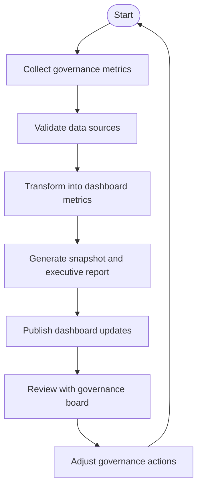

# Governance Dashboard

Objectives

- Central dashboard to report KPIs, health metrics, risks and upcoming governance actions.

Scope

- Executive and operational views for documentation governance.

Stakeholders

- Governance Board, Content Owners, Senior Technical Writer.

Deliverables

- Dashboard wireframes and data mapping for the MkDocs site and external BI tools.

Governance dashboard workflow

Processes

- Weekly snapshot generation, monthly executive reports.

Governance Mechanisms

- Dashboard owner and update cadence.

Templates

- Dashboard report template and data export format.

Metrics

- Key KPIs as defined in `41-documentation-kpis.md`.

Risks

- Data inconsistency between sources.

Mitigation Strategies

- Single source of truth for metrics and scheduled reconciliations.

Best Practices

- Provide both high-level KPIs and drill-down capability for owners.
