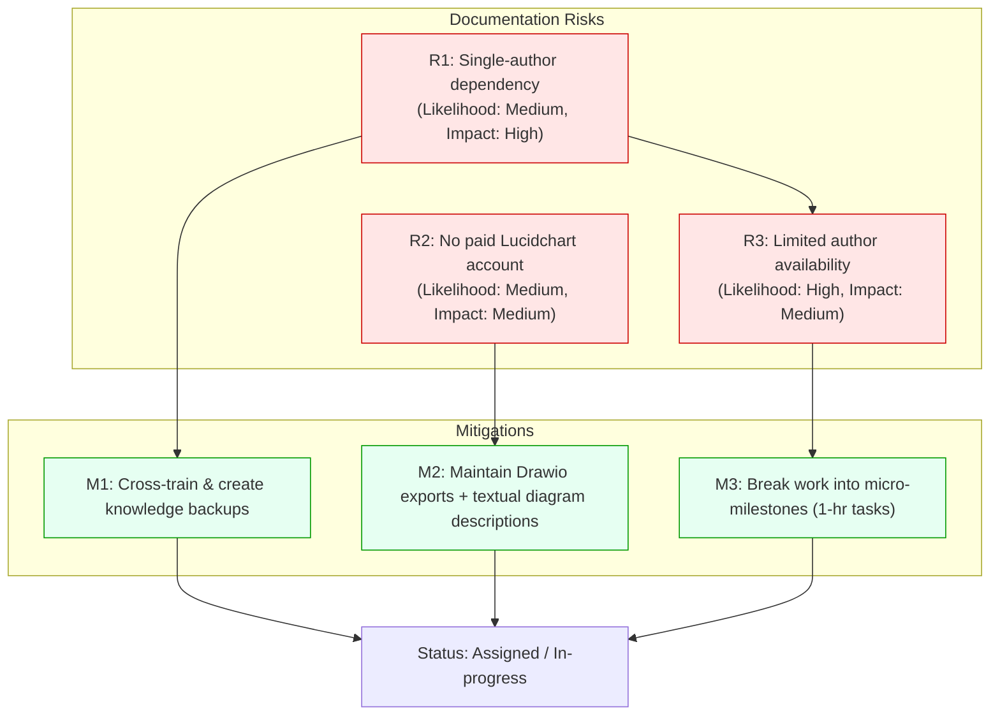

# Documentation Risk Register

Objectives

- Maintain a register of documentation-specific risks with owners and mitigations.

Scope

- Risks to documentation quality, continuity, compliance and availability.

Stakeholders

- Governance Board, Risk Owner, Content Owners.

Deliverables

- Risk register table (example rows below) and mitigation plans.

Processes

- Quarterly review and update; escalate high risks.

Governance Mechanisms

- Risk owner assignment and review cadence.

Templates

- Risk register CSV/YAML template.

Example entries
| ID | Risk | Likelihood | Impact | Owner | Mitigation |
|----|------|------------|--------|-------|------------|
| R1 | Single-author dependency | Medium | High | Content Owner | Cross-train and capture knowledge |
| R2 | No paid Lucidchart account | Medium | Medium | Senior Technical Writer | Use Drawio backups and textual diagrams |
| R3 | Limited author availability (1 hr/day) | High | Medium | Project Owner | Micro-milestones and backlog prioritisation |

Metrics

- Number of open high risks, mitigation progress.

Risks

- Untracked risks; stale mitigations.

Mitigation Strategies

- Automate reminders and keep register close to governance dashboard.

Best Practices

- Keep register actionable and assign owners for each mitigation.

Sample risk-to-mitigation diagram (Mermaid)

The following Mermaid flowchart visualises a subset of register entries, their likelihood/impact notes, and mapped mitigations. Copy this into any Mermaid-capable renderer (MkDocs with a Mermaid plugin, or mermaid.live) to view the diagram.

Use this diagram as an example — expand the register table above and map additional rows to diagram nodes for board-level visualisations.

# Documentation Risk Register

Objectives

- Maintain a register of documentation-specific risks with owners and mitigations.

Scope

- Risks to documentation quality, continuity, compliance and availability.

Stakeholders

- Governance Board, Risk Owner, Content Owners.

Deliverables

- Risk register table (example rows below) and mitigation plans.

Processes

- Quarterly review and update; escalate high risks.

Governance Mechanisms

- Risk owner assignment and review cadence.

Templates

- Risk register CSV/YAML template.

Example entries
| ID | Risk | Likelihood | Impact | Owner | Mitigation |
|----|------|------------|--------|-------|------------|
| R1 | Single-author dependency | Medium | High | Content Owner | Cross-train and capture knowledge |

Metrics

- Number of open high risks, mitigation progress.

Risks

- Untracked risks; stale mitigations.

Mitigation Strategies

- Automate reminders and keep register close to governance dashboard.

Best Practices

- Keep register actionable and assign owners for each mitigation.
