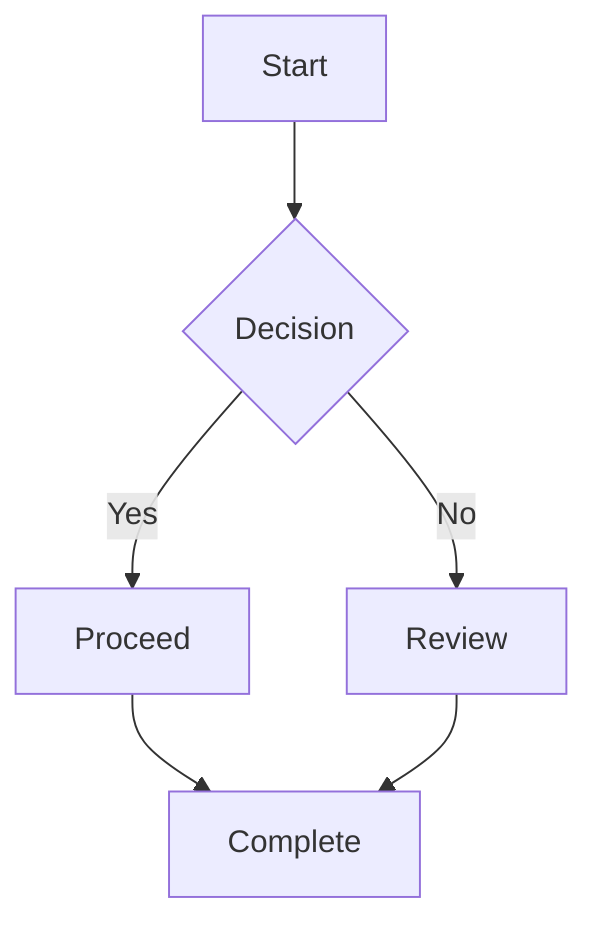
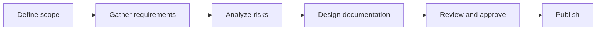
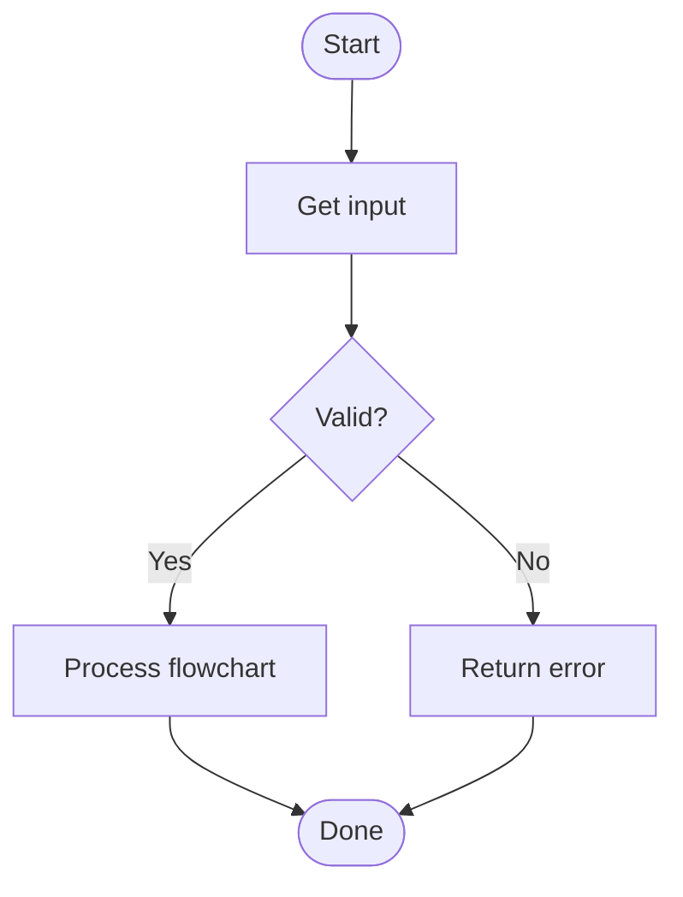

# Flowchart Diagrams

This page demonstrates how to include flowcharts in the documentation using Mermaid syntax and the `mkdocs-mermaid2-plugin` configured in `mkdocs.yml`.

## Basic Flowchart

## Process with multiple steps

## Conditional workflow example

## Notes

- Mermaid diagrams are rendered automatically by the `mkdocs-mermaid2-plugin`.
- Any Mermaid `flowchart` block in Markdown can be added to docs pages.
- For additional diagram types, see the Mermaid documentation: https://mermaid.js.org/
